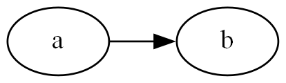

# Module Connection

```@meta 
CurrentModule = VerilogWriter
DocTestSetup = quote
    using VerilogWriter
end
```

We offer here a tool to help creating a connection between multiple verilog modules.

## Midmodule
Here we wrap a `Vmodule` object with `Midmodule` objects. 

```jldoctest m1
julia> a = Midmodule(Vmodule("a"));

julia> println(typeof(a));
Midmodule
```

`Midmodule` objects can be handled in a similar manner to that of `Vmodule`. You may add, for example, ports and always-blocks, using `vpush!`.

```jldoctest m1
julia> vpush!(a, @always (
       counter <= counter + $(Wireexpr(8, 1))
       ));

julia> vshow(a.vmod);
module a ();
    always_ff @( unknownedge  ) begin
        counter <= (counter + 8'd1);
    end
endmodule
type: Vmodule
```

## Mmodgraph

We handle connections in between `Midmodule`s using `Mmodgraph` objects.

```jldoctest m1
julia> g = Mmodgraph();
```

`Mmodgraph` is a callable object, and you may register connections between `Midmodule`s to this object.

```jldoctest m1
julia> g(a => b);
```

We also offer a method to convert `Mmodgraph` into a graph written in DOT language, and the connections can be visualized this way.

```jldoctest m1
julia> dotgen(g; dpi=196) |> println;
digraph{
rankdir = LR;
dpi = 196;

a [shape=oval];
b [shape=oval];
a -> b;
}
```

Using, for example, Graphviz, the graph below would be generated.



## Connect Ports between Verilog Modules

The connection in the example above connected Midmodule `a` and `b`. However, there is no data transaction available between the modules. You may explicitly register name of ports to be connected between `Midmodule`s. Here we construct new connection from Midmodule `a` to `c`.

```jldoctest m1
julia> Midmodule(Vmodule("c"));

julia> g(a => c, @pconnect dout => din);
```

Here we declared the connection between `a` and `c`. Note that at this time the Midmodules do not contain ports declared here. You also need to add the ports to each Midmodule object.

```jldoctest m1
julia> vpush!(a, @ports @out @logic 8 dout);

julia> vpush!(c, @ports @in 8 din);
```

## Generate Vmodule Objects

After adding logics and ports to each `Midmodule`, you may generate a list of `Vmodule`s exported from `Mmodgraph`.

```jldoctest m1
julia> vmods = layer2vmod!(g);

julia> println(typeof(vmods));
Vector{Vmodule}
```

At the head of the exported list of `Vmodule`s is the top level `Vmodule` which represents the whole `Mmodgraph`, and the rest are the modules which are instanciated inside the top module. You may call `vfinalize.(vmods)` to further conduct wire width inferences and wire declarations.

### Port Lifting

Each `Midmodule` objects can have (verilog) ports that are not connected to other `Midmodule`s. These ports are automatically added to the top level `Vmodule` when calling `layer2vmod!` and is accessible from outer verilog modules.