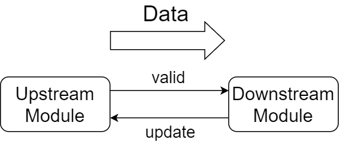

# Mid-Level Synthesis

```@meta 
CurrentModule = VerilogWriter
DocTestSetup = quote
    using VerilogWriter
end
```

We offer here a tool to help creating a connection between multiple verilog modules.

!!! warning
    Methods described in this section is not fully debugged yet. Verilog codes generated using funtionalities in this page may contain unexpected behavior, and thus having precise inspection on output codes is desirable.


## Midmodule
Here we wrap a `Vmodule` object with `Midmodule` objects. 

```jldoctest m1
julia> a = Randmmod("a");

julia> println(typeof(a));
Midmodule

julia> @Randmmod b; # declare Midmodule named "b" as variable `b`
```

`Midmodule` objects can be handled in a similar manner to that of `Vmodule`. You may add, for example, ports and always-blocks, using `vpush!`.

```jldoctest m1
julia> vpush!(a, @always (
       counter <= counter + $(Wireexpr(8, 1))
       ));

julia> vshow(a.vmod);
module a ();
    always_ff @( unknownedge  ) begin
        counter <= (counter + 8'd1);
    end
endmodule
type: Vmodule
```

## Mmodgraph
We handle connections in between `Midmodule`s using `Mmodgraph` objects.

```jldoctest m1
julia> g = Mmodgraph();
```

`Mmodgraph` is a callable object, and you may register connections between `Midmodule`s to this object.

```jldoctest m1
julia> g(a => b);
```

We also offer a method to convert `Mmodgraph` into a graph written in DOT language, and the connections can be visualized this way.

```jldoctest m1
julia> dotgen(g; dpi=196) |> println;
digraph{
rankdir = LR;
dpi = 196;

a [shape=oval];
b [shape=oval];
a -> b;
}
```

Using, for example, Graphviz, the graph below would be generated.


## Connect Ports between Verilog Modules

The connection in the example above connected Midmodule `a` and `b`. However, there is no data transaction available between the modules. You may explicitly register ports to be connected between `Midmodule`s. Here we construct new connection from Midmodule `a` to `c` with an eight-bits wide data line.

```jldoctest m1
julia> @Randmmod c;

julia> g(a => c, [(@oneport @out 8 dout) => (@oneport @in 8 din)]);
```

We declare the connection between `a` and `c` using `Oneport`. Note that at this time the Midmodules do not contain ports declared here. You also need to add the ports to each Midmodule object.

```jldoctest m1
julia> vpush!(a, @ports @out @logic 8 dout);

julia> vpush!(c, @ports @in 8 din);
```

### Automatically-Generated Connections
When adding connection to `Mmodgraph`s, VerilogWriter.jl automatically adds to both upstream and downstream module two ports, which are `valid` and `update` lines.

These ports can be used to control timing when a transaction between `Midmodule`s occurs.



`valid` is the signal driven by upstream module, and when asserted the data lines connected between the modules should contain valid data.

`update` is the signal driven by downstream module, and asserting the signal tells upstream modules that the data lines can be updated with new data.

This may be similar to the First-Word-Fall-Through model in that downstream modules may process data before returning any signal (such as an acknowledgement signal).

As is often the case with handshaking signals, `valid` signals **must not** wait for the `update` signals. `valid` should be asserted independently from `update` (at least from `update` value at the same clock cycle) in order to avoid creating combinational loop in verilog codes.

Note that VerilogWriter.jl only adds the ports to `Midmodule`s, and thus you need to add to each `Midmodule` object logics that properly handle the `valid` and `update` signals. This also means that you may completely ignore the `update` and `valid` signals even when using `Mmodgraph` (you may need to connect the signals to `0` or `1` to suppress warnings from compilers, though).

To get the name of `valid` and `update` ports, you may call `nametolower` (for downstream facing ports) or `nametoupper` (for upstream facing ports) method with enum value `imupdate` or `imvalid`.

```jldoctest m1
julia> alb = @always (
       $(nametoupper(imupdate)) <= 1; # always update
       if $(nametoupper(imupdate)) & $(nametoupper(imvalid))
           recv_count <= recv_count + $(Wireexpr(8, 1))
       end
       );

julia> vpush!(b, alb);
```

### Synchronizing Transactions

`g::Mmodgraph` in the above example currently generates the graph below.


When connecting more than one downstream `Midmodule` to one upstream `Midmodule`, VerilogWriter.jl automatically adds synchronizing logic to `Mmodgraph`.
`valid` and `update` signals are modified automatically and a transaction between `a` and `b/c` does not complete unless both `b` and `c` assert `update` signal to `a`. From upstream module's (`a`'s) perspective, `b` and `c` look like a single module which has one `update` and one `valid` port.

```jldoctest m1
julia> ala = @always (
       $(nametolower(imvalid)) <= 1;
       if $(nametolower(imvalid)) & $(nametolower(imupdate))
           send_count <= send_count + $(Wireexpr(7, 1))
       end
       ); # the same `valid` and `update` wire is connected to both `b` and `c`

julia> vpush!(a, ala); vshow(a.vmod);
module a (
    output logic [7:0] dout
);
    always_ff @( unknownedge  ) begin
        counter <= (counter + 8'd1);
    end
    always_ff @( unknownedge  ) begin
        valid_to_lower_port0 <= 1;
        if ((valid_to_lower_port0 & update_from_lower_port0)) begin
            send_count <= (send_count + 7'd1);
        end
    end
endmodule
type: Vmodule
```

The same applies to cases where a single downstream `Midmodule` is connected to multiple upstream `Midmodule`s. Note that ports other than `valid` and `update` in downstream `Midmodule` cannot be connected to multiple upstream ports, which is the same as connecting ports in raw verilog module instances. For now no warning and error is returned from VerilogWriter.jl even in such erroneous cases, and it can be detected, for instance, applying linter on generated verilog outputs.

```jldoctest m1
julia> @Randmmod d;

julia> g(d => c, [(@oneport @out 32 douttoC) => (@oneport @in 32 dinfromD)]
       ); # must not connect to `din` in `c`, which is already connected to `a`

julia> vpush!(c, @oneport @in 32 dinfromD); vpush!(d, @oneport @out 32 douttoC);

julia> vpush!(c, @always (
       $(nametoupper(imupdate)) = 1
       )); # connected to `update` of both `a` and `d`
```

### Suppress Synchronization in Connecting `Midmodule`s

There are cases where multiple connection from one `Mmodule` should be completely independent from one another. In such cases you may wrap connection in `Midport` to separate connections to multiple groups.

```jldoctest m1
julia> @Randmmod e;

julia> @assert 1 != defaultMidPid; # currently defaultMidPid == 0

julia> vpush!(e, @oneport @in 8 dinfroma);

julia> g(Midport(1, a) => Midport(defaultMidPid, e), 
       [(@oneport @out 8 dout) => (@oneport @in 8 dinfroma)]
       ); # connect `a` at Midport id 1 to `e`
```

Currently `g` generates the graph below:


Connections between `Midport`s is not synchronized if they have different `Midport` id (a member`::Int` of `Midport`). In the example above, `a::Midmodule` is connected to three `Midmodule`s, which are `b`, `c` and `e`. Connection between `a` and `e` is assigned Midport id `1`, while connection between others are assigned `defaultMidPid` (this port id is assigned to the connection which is registered to `Mmodgraph` without explicitly specifying port id). Therefore, transaction between `a` and `b/c` is synchronized through `valid` and `update` independently from transactions between `a` and `e`. As a consequence `a` needs to include additional logic to handle `valid` and `update` signal for Midport whose id is other than `defaultMidPid`.

```jldoctest m1
julia> vpush!(a, @always (
       if $(nametolower(imvalid, 1)) & $(nametolower(imupdate, 1))
           $(nametolower(imvalid, 1)) <= 0;
       else
           $(nametolower(imvalid, 1)) <= 1
       end
       )); # valid and update associated with Midport(1, a)
```

## Generate Vmodule Objects
After adding logics to each `Midmodule`, you may generate a list of `Vmodule`s exported from `Mmodgraph`.

```jldoctest m1
julia> vmods = layer2vmod!(g);

julia> println(typeof(vmods));
Vector{Vmodule}
```

At the head of the exported list of `Vmodule`s is the top level `Vmodule` which represents the whole `Mmodgraph`, and the rest are the modules which are instanciated inside the top module. You may call `vfinalize.(vmods)` to further conduct wire width inferences and wire declarations.

### Port Lifting
Each `Midmodule` objects can have (verilog) ports that are not connected to other `Midmodule`s. These ports are automatically added to the top level `Vmodule` when calling `layer2vmod!` and is accessible from outer verilog modules.