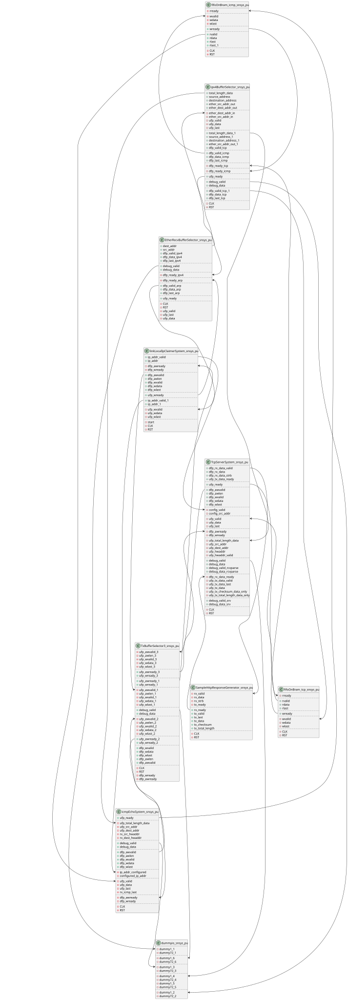
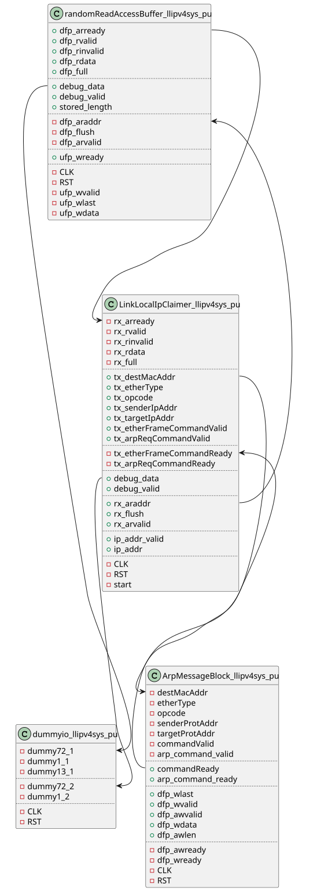
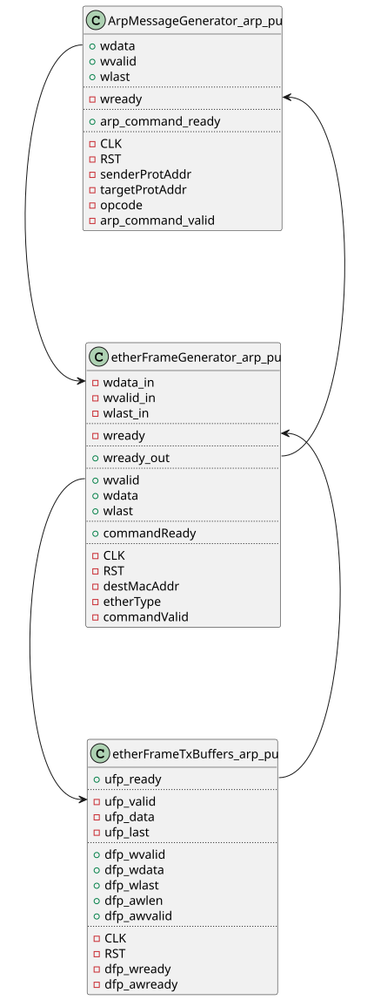
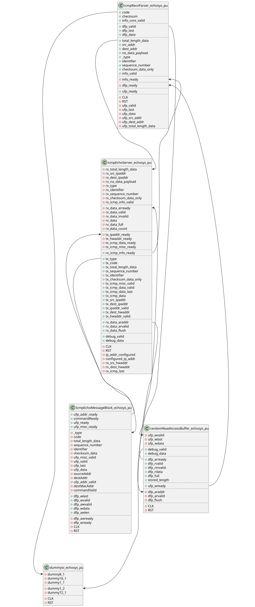
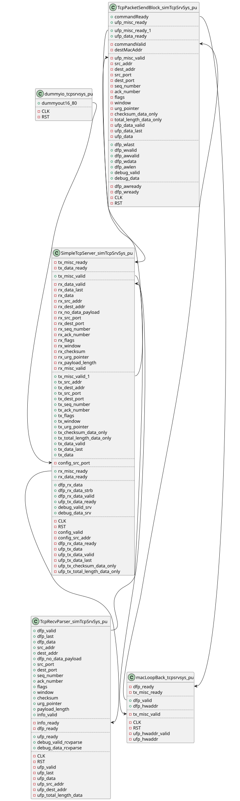
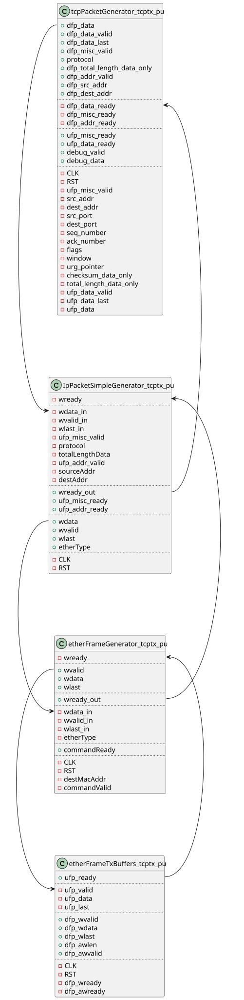

# HTTP Server Sample

Below `ethernet/http` are modules that work as an experimental HTTP server.

Currently the top level module receives and sends ethernet frames through an AXI-like interface (i.e. ports that consist of valid, ready, last and data) whose data bus is 32 bit wide. To further transmit and receive the frames through an external LAN ports, you need to connect the module to PHY layer (e.g. through MII/RMII).

+ [Top-Level Module](@ref)
  + [Link Local IP Address Claimer](@ref)
    + [ARP Message Block](@ref)
  + [ICMP Echo Reply](@ref)
  + [TCP Server](@ref)
    + [TCP Packet Sending Block](@ref)
  + [Miscellaneous](@ref)

## Top-Level Module

!!! details "Block Diagram"
    

As shown in the diagram this module includes the following functionalities:

+ Configure link local IP address
+ Reply to an ICMP echo request
+ Wait TCP connection

## Link Local IP Address Claimer

!!! details "Block Diagram"
    

As defined in RFC 3927 try configuring a link local IP address (not fully compliant with RFC 3927).

After announcing an address this module keep defending the IP address.

### ARP Message Block

!!! details "Block Diagram"
    

A block to generate an ARP ethernet frame.

## ICMP Echo Reply

!!! details "Block Diagram"
    

Reply to an ICMP echo message.

## TCP Server

!!! details "Block Diagram"
    

A TCP control block listening for one TCP connection. Currently this module does not actively close a connection, and a client must initialize a closing handshake by sending a FIN packet.

### TCP Packet Sending Block

!!! details "Block Diagram"
    

A block to generate a TCP packet.

## Miscellaneous

TBD
